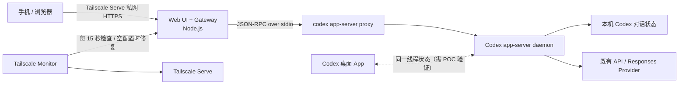

# Codex 远程控制台设计方案

## 1. 目标与边界

目标是在外出时通过网页管理 Mac 上的 Codex 对话：查看、搜索、创建、继续、追加指令、停止、分叉、改名、归档和删除，并能处理必要的执行审批。

这个方案面向 **API / 自定义 Responses Provider 登录的 Codex**。网页不登录 ChatGPT、不依赖 ChatGPT App，也不保存 OpenAI API key、Bearer token 或 `~/.codex/config.toml` 的内容。模型请求始终由 Mac 上已经配置好的 Codex 进程发起。

非目标：

- 通过网页模拟点击 macOS 桌面 App。
- 直接读取或写入 `~/.codex` 的 SQLite、JSONL 或认证文件。
- 将具有本机命令执行能力的控制接口暴露到公网。

## 2. 推荐架构



### 组件职责

| 组件 | 职责 | 不应承担的职责 |
| --- | --- | --- |
| Web UI | 列表、对话流、操作按钮、待审批提示 | 保存凭据、直接访问本机 Codex 数据库 |
| Gateway | 身份校验、权限控制、JSON-RPC 转发、事件推送、审计 | 直接调用模型 Provider |
| `codex app-server proxy` | 将 Gateway 的标准输入输出安全地转到本地控制 socket | 对外网监听 |
| Codex app-server daemon | 线程生命周期、流式事件、审批、现有 Codex 配置与 API 调用 | 网页用户认证 |
| Tailscale | 仅在个人私网内提供访问路径 | 替代应用层授权与审计 |
| Tailscale Monitor | 检查本机 Tailscale 在线状态与 WebUI Serve 路由；只在配置为空时自动建立入口 | 覆盖用户已有 Serve 路由、启用 Funnel 或暴露其他节点信息 |

当前 Mac 上的 Codex CLI 已提供实验性 `app-server` 与 `remote-control`。生成的本地协议 schema 包含 `thread/list`、`thread/read`、`thread/start`、`thread/resume`、`thread/fork`、`thread/archive`、`thread/delete`、`thread/name/set`、`turn/start`、`turn/steer` 与 `turn/interrupt` 等方法，能覆盖本项目核心功能。

## 3. 本机运行方式

首次在 Mac 上安装常驻管理服务：

```bash
codex app-server daemon bootstrap --remote-control
```

日常启动或检查时使用：

```bash
codex remote-control start --json
codex app-server daemon version
```

Gateway 不应连接一个公开的 app-server 监听端口，而应优先在本机启动子进程：

```text
codex app-server proxy
```

并通过它的 stdin/stdout 发送 JSON-RPC。这样 daemon 的本地控制 socket、认证和 API 配置都留在 Mac 内部。

某些 npm / 桌面 App 所携带的 Codex CLI 没有 Codex installer 管理的 standalone 安装，因此不能启动 `remote-control` daemon。第一版 Gateway 会自动改用 `codex app-server --stdio` 作为直接本机 transport；它不暴露网络端口，且仍沿用同一台 Mac 的 Codex 配置。安装 standalone 后，应用会自动优先恢复为 daemon + proxy transport。

> `app-server` 与 `remote-control` 是实验性接口。实现前应在 POC 中验证当前桌面 App 与该 daemon 是否显示同一线程；若双端不能实时同步，则规定网页为该线程的唯一控制端，不允许两端同时发送指令。

## 4. Gateway API 与事件模型

Gateway 只向网页公开自己定义的 HTTPS API，不把底层 JSON-RPC 原样暴露给浏览器。

### MVP 路由

| 网页 API | 内部 Codex 操作 | 说明 |
| --- | --- | --- |
| `GET /api/threads` | `thread/list` | 支持项目目录、标题、归档和状态筛选 |
| `GET /api/threads/:id` | `thread/read` | 获取线程及可选 turn 历史 |
| `POST /api/threads` | `thread/start` | 指定工作目录、模型与权限策略创建线程 |
| `POST /api/threads/:id/messages` | `turn/start` / `turn/steer` | 空闲时开始新 turn，运行中则追加 steering |
| `POST /api/threads/:id/interrupt` | `turn/interrupt` | 停止当前执行 |
| `PATCH /api/threads/:id` | `thread/name/set` 等 | 重命名或更新展示元数据 |
| `POST /api/threads/:id/archive` | `thread/archive` | 归档线程 |
| `DELETE /api/threads/:id` | `thread/delete` | 要求二次确认 |
| `GET /api/events` | server notifications | 使用 SSE 推送 token、状态、diff 与审批请求 |
| `GET /api/providers` | provider adapter | 返回脱敏后的 CC Switch 服务商及当前状态 |
| `POST /api/providers/:id/activate` | provider adapter | 立即切换或排队到当前轮次结束后切换 |
| `POST /api/providers/portable/install` | portable installer | 下载并校验固定版本的本机 CLI 适配器 |

浏览器为每个线程维护事件游标；断线后先重新读取线程状态，再从最新游标继续订阅。Gateway 必须按 `threadId` 串行化写操作，避免桌面端和网页端、或两个浏览器标签页同时对同一线程启动 turn。

## 5. 页面范围

### MVP

- 线程列表：标题、工作目录、当前状态、最后更新时间、归档筛选与搜索。
- 手动全量同步：左侧刷新按钮遍历 `thread/list` 的全部游标分页，并在存在当前选中任务时重新读取其完整详情；同步过程中禁止重复触发。
- 主题化侧栏：项目标题的普通背景、悬停背景、主文字、次要图标、数量徽标和“非项目”分组分别使用导航语义变量，禁止继承主内容区文字色或直接复用侧栏底色，保证所有主题下均有稳定对比度。
- 线程详情：消息时间线、流式输出、工具执行状态、计划与最终答复。
- 指令输入：新建线程、继续现有线程、运行中追加指令、停止。
- 管理操作：重命名、分叉、归档、删除。
- 审批队列：展示命令、工作目录、风险说明；用户明确点击后才提交批准或拒绝。
- 连接状态：Mac / Codex 在线状态、Tailscale 在线状态与当前 Tailnet HTTPS 入口。
- Codex 原生 UI 指令：将助手输出的 Git 暂存、提交、推送、建分支和建 PR 指令渲染为操作卡片；代码示例和用户消息不转换。

### 后续迭代

- 项目卡片与常用工作目录模板。
- 推送通知：turn 完成、失败或等待审批时通知手机。
- 变更 diff 与后台终端视图。
- 只读访客模式；默认不做多人写入。
- PWA 离线壳与移动端优化。

## 6. 安全要求

该系统可以代表用户让 Codex 在 Mac 上执行命令，应按远程管理面板对待。

1. 仅通过 Tailscale tailnet 访问；Web 服务绑定 `127.0.0.1`，不使用公网端口映射和 Tailscale Funnel。
   WebUI 进程每 15 秒检查 `tailscale status --json` 与 `tailscale serve status --json`。仅当 Serve 配置完全为空时才自动建立到 `127.0.0.1:8787` 的后台路由；发现其他路由时必须保留原配置并报告冲突。
2. Gateway 实施单用户强认证：优先 Tailscale 身份叠加本地会话 / Passkey；会话使用短有效期、Secure、HttpOnly、SameSite cookie。
3. 每个写接口强制 CSRF 防护、请求限流和服务端授权；删除、降低沙箱限制、切换到 `never` 审批策略必须二次确认。
4. 默认采用 Codex 的保守审批策略；网页只能转发明确出现的审批请求，不能自动批准命令、文件修改或网络访问。
5. 审计日志仅记录操作者、时间、线程、动作和决策；提示词与模型输出默认不写入额外日志。
6. `.env`、证书、日志和运行时数据必须被 Git 忽略；绝不复制 `~/.codex/config.toml`、认证文件或 API token 到仓库。
7. 升级 Codex CLI 前，在测试环境生成并比较协议 schema：

   ```bash
   codex app-server generate-json-schema --experimental --out /tmp/codex-schema
   ```

## 7. 技术选型

- **第一版前后端**：Node.js 内置 HTTP 服务 + 浏览器端 ES modules；使用 esbuild 将前端代码、KaTeX 字体和样式构建到 `dist/public`。后续需要复杂路由和多用户认证时再迁移到 Next.js + TypeScript。
- **富文本渲染**：Markdown-it 解析消息，KaTeX 渲染行内/块级公式，highlight.js 对显式标注语言的代码块高亮。原始 HTML 不参与 Markdown 解析，渲染前后均由 DOMPurify 清理；远程图片降级为文本占位，普通链接使用 `noopener noreferrer` 在新标签页打开。
- **浏览器防护**：静态服务发送严格 CSP、`X-Content-Type-Options`、`Referrer-Policy`、`Permissions-Policy` 和禁止嵌入的响应头。脚本、样式和字体全部同源提供，不依赖第三方 CDN。
- **进程通信**：Node.js `child_process` 管理一个或受控池化的 `codex app-server proxy` 连接；实现 JSON-RPC 请求 ID、超时、重连和通知分发。
- **实时通道**：SSE 优先（对移动网络重连简单）；需要双向实时输入时再加入 WebSocket。
- **持久化**：SQLite 或 Postgres 仅保存 Web 用户、偏好、审计与通知投递状态；Codex 线程内容以 app-server 为准。
- **部署**：Mac 用户级 `launchd` 守护 Gateway，设置 `RunAtLoad` 与 `KeepAlive`；启动入口先构建前端再载入服务。LaunchAgent 直接调用安装时解析出的稳定 Node 路径，不依赖交互式 shell、fnm 临时 multishell 路径或 Codex 临时终端。Tailscale 提供私网访问。
- **网络监控**：服务内置轻量定时检查，并通过 SSE 将连接变化推送到网页。监控状态只包含本机在线状态、MagicDNS 名称和 WebUI URL，不向浏览器传递其他 tailnet 节点。

## 8. 实施顺序与验收

### POC

1. 启动受 remote-control 管理的 daemon。
2. 用一个极小 Node 脚本通过 `codex app-server proxy` 完成 `initialize`、`thread/list`、`thread/read`。
3. 创建测试线程并发起一次只读指令，确认流式事件、停止与审批事件可接收。
4. 验证网页创建 / 恢复的线程与桌面 App 的可见性和并发行为。

验收：不用 ChatGPT 登录，且 API token 不离开 Mac，即可在本机安全完成一次“列出线程 → 发消息 → 查看完成结果”的全流程。

### MVP

1. 实现 Gateway adapter、线程 API 和 SSE。
2. 实现线程列表、详情、输入框、停止、归档和删除确认。
3. 接入 Tailscale、认证、审计与 `launchd`。
4. 在手机网络下验证断线重连、休眠后恢复和审批流程。

验收：从外网的个人设备上，能安全管理一个正在运行的 Codex 线程，且所有高风险操作仍须显式审批。

## 9. 运行前提与风险

- Mac 必须保持开机、联网，且不能因深度睡眠失去 Tailscale 连通性；需要在 macOS 电源设置中评估“保持网络可用”的策略。
- WebUI 必须通过用户级 LaunchAgent 常驻运行；从临时终端执行 `npm run dev` 只适合开发。否则终端或 Codex 会话结束后本机 `8787` 端口会消失，而仍在线的 Tailscale Serve 会向访问设备返回 `502 Bad Gateway`。
- 自定义 API Provider 的可用性、限流和 token 刷新仍由本机 Codex 配置负责，网页不应尝试接管。
- app-server 处于实验阶段，CLI 升级可能改变协议。因此 Gateway 必须隔离成 `CodexAdapter`，并为 `list/read/start/stream/approval` 编写集成测试。
- 不要对同一线程同时使用桌面 App、CLI 和网页发送 turn；至少在 MVP 阶段由 Gateway 加锁并在界面中显示“此线程正在其他客户端使用”。
